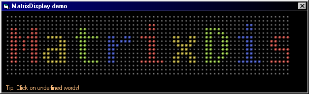



## MatrixDisplay

### Description

A LEDMatrix display, very customizable, with built-in text support, multiple colors. For more, see the code. It's heavily commented.

Please leave a feedback, and vote!

Thanks.
 
### More Info
 

             |
---                |---
**Submitted On**   |2003-10-05 21:46:52
**By**             |[Mihály Tallódi](https://github.com/Planet-Source-Code/PSCIndex/blob/master/ByAuthor/mih-ly-tall-di.md)
**Level**          |Intermediate
**User Rating**    |4.9 (103 globes from 21 users)
**Compatibility**  |VB 6\.0
**Category**       |[Graphics](https://github.com/Planet-Source-Code/PSCIndex/blob/master/ByCategory/graphics__1-46.md)
**World**          |[Visual Basic](https://github.com/Planet-Source-Code/PSCIndex/blob/master/ByWorld/visual-basic.md)
**Archive File**   |[MatrixDisp1654731062003\.zip](https://github.com/Planet-Source-Code/mih-ly-tall-di-matrixdisplay__1-49051/archive/master.zip)

